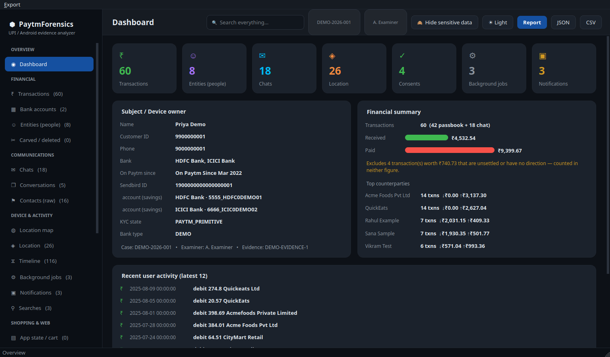
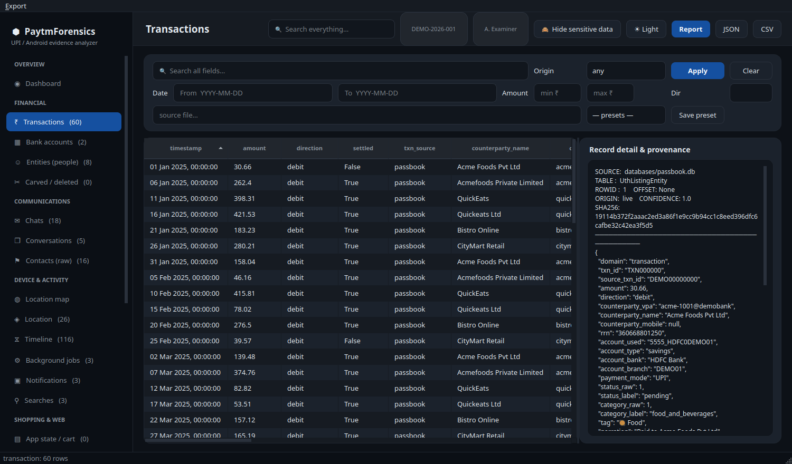
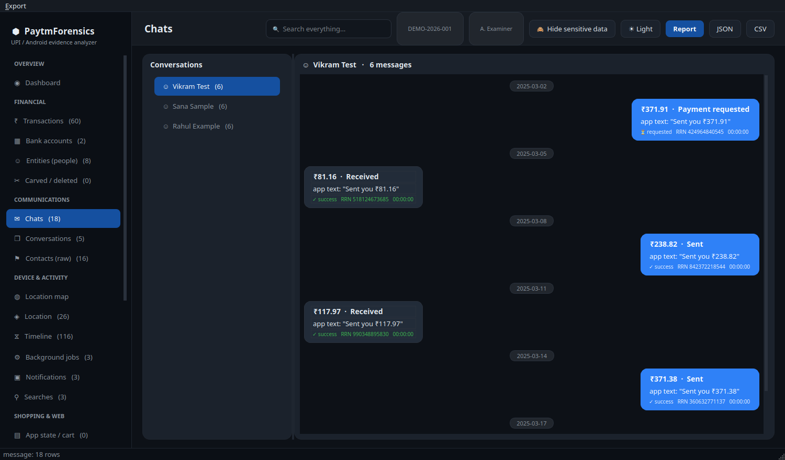
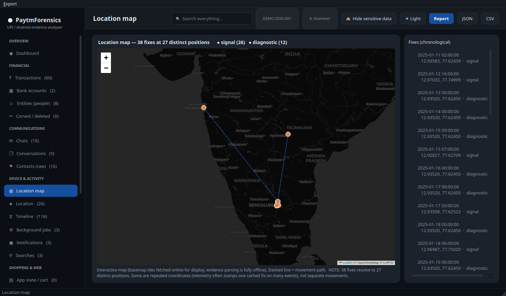
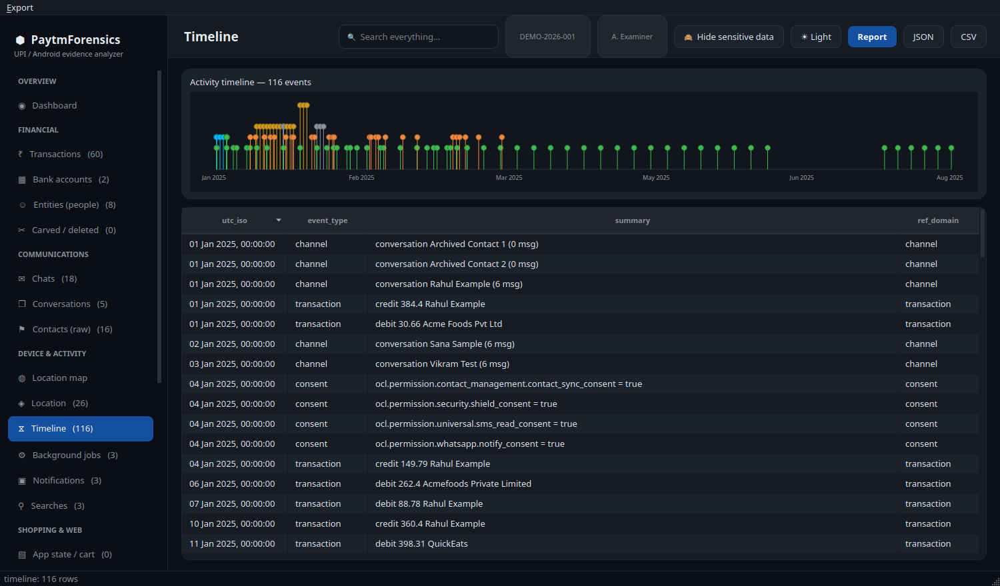
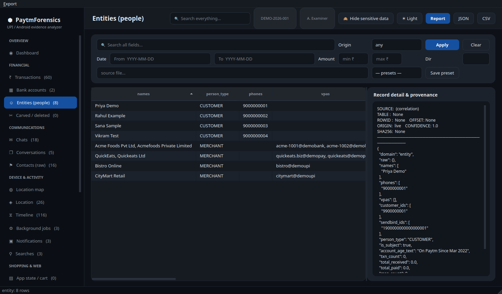
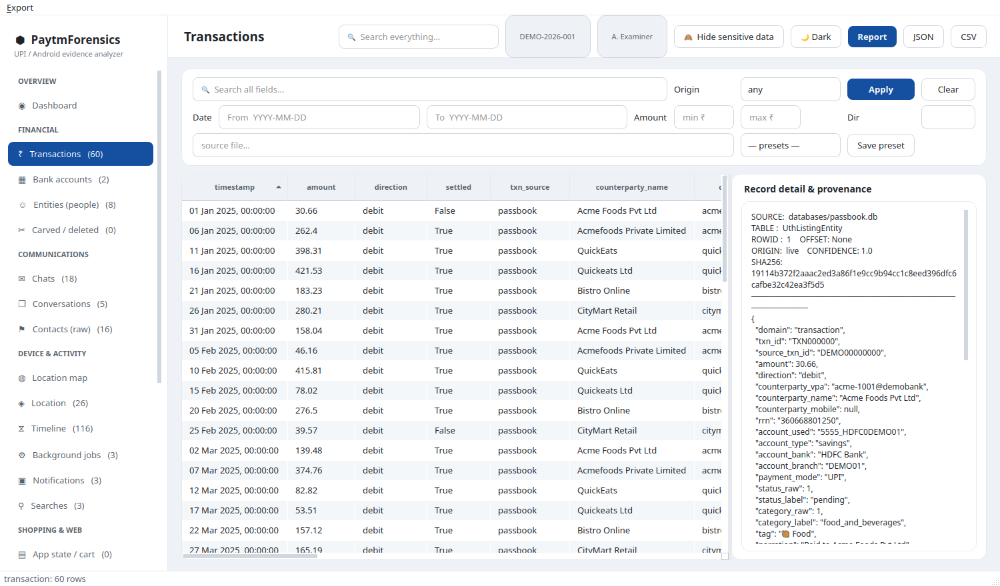
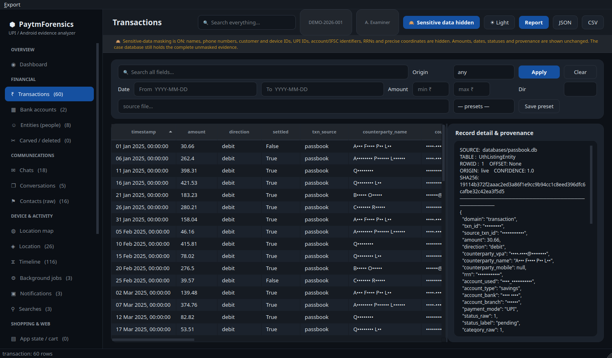

# PaytmForensics

**Turn an acquired Paytm app folder into a complete, attributable case — in seconds.**

Offline, read-only forensic parser and analysis GUI for the Paytm Android app
(`net.one97.paytm`). Point it at an already-acquired data folder; it decodes ~20 SQLite
databases, encrypted stores, WebView data and preferences into one chronological case with
per-record provenance, then gives you a desktop UI, a self-contained report, and exports.



> *Every screenshot shows **fabricated demonstration data** built by
> `tools/make_demo_case.py`. No real device, person or account appears anywhere.*

---

## Table of contents
- [Features](#features)
- [Try it in 30 seconds](#try-it-in-30-seconds)
- [Screenshots](#screenshots)
- [Install](#install)
- [Usage](#usage)
- [What it parses](#what-it-parses)
- [Hiding sensitive data](#hiding-sensitive-data)
- [Forensic controls](#forensic-controls)
- [WAL-aware reading](#wal-aware-reading)
- [Output layout](#output-layout)
- [Architecture](#architecture)
- [Quality and validation](#quality-and-validation)
- [Limitations](#limitations)
- [Packaging](#packaging)
- [Roadmap](#roadmap)
- [Disclaimer](#disclaimer)

---

## Features

**Parsing — 39 parsers, 21 record domains**
- Full UPI **transaction ledger** from the passbook, plus payments evidenced only in chat,
  deduplicated on `sourceTxnId` so nothing is counted twice
- **NPCI RRN** and **UPI VPA** extraction, cross-validated between the ledger and chat
- **Chat reconstruction** from the Sendbird tables — conversations, participants, payment
  amount / status / RRN per message, and conversations whose messages are gone
- **Location history** from signal databases and WebView cookies
- Contacts, consents, background jobs, notifications, searches, app config and feature
  flags, diagnostics, WebView cookies / storage / cache, capabilities, cart, crash sessions
- **Encrypted-artifact catalogue** — TEE-bound stores are enumerated with cipher, keystore
  alias and the reason they cannot be decrypted, never guessed at

**Correlation**
- **Entity resolution** merges phone / VPA / customer-id / Sendbird-id across every source
  into one counterparty, with name normalisation so `FoodCo` and `Foodco`, or
  `Acme Foods Pvt Ltd` and `Acmefoods Private Limited`, are one party rather than four
- **Master timeline** merging every timestamped record from every domain, stored in
  chronological order so the GUI, report and CSV all agree
- **Offline IFSC → bank resolution** and bundled error-code decoding

**Recovery**
- **Deleted-record carving** over freelist pages, intra-page freeblocks and slack — across
  **every** database *and* every `-wal`, deduplicated against live values, labelled
  `origin=carved` with a confidence

**Analysis GUI** (PySide6)
- Dashboard with subject profile, financial summary and recent activity
- Sortable, filterable grid for every domain, with a provenance panel on every record
- Filters: free text, date range, amount range, direction, live/carved, source file —
  combined with AND, and **saved as presets per case**
- WhatsApp-style chat view, interactive map, timeline ribbon, global search
- Light and dark themes, both meeting WCAG AA contrast

**Privacy**
- **Hide sensitive data** toggle — mask PII and bank identifiers across the entire UI and
  exports for screen-sharing, without altering the case

**Output**
- Self-contained **HTML report** with inline SVG charts and per-record provenance
- Deterministic **JSON / CSV** exports, **KML / GeoJSON** for locations
- **Hash-chained audit log**, verifiable by a third party

**Evidence integrity**
- Read-only opens, SHA-256 + MD5 manifest, byte-identical verification, and
  [WAL-aware reading](#wal-aware-reading) so uncheckpointed rows are not silently lost

## Try it in 30 seconds

No extraction needed — this builds a fabricated one, parses it, and opens the GUI:

```bash
python -m pip install -r requirements.txt
python tools/make_demo_case.py /tmp/ptmf-demo
python run_gui.py /tmp/ptmf-demo/case
```

`make_demo_case.py` invents a subject, six merchants, three contacts, 60 transactions, a
chat history, a movement history across three Indian cities, consents, jobs and
diagnostics — and deliberately leaves the newest transactions in an uncheckpointed WAL so
you can watch that path work.

## Screenshots

**Transactions** — filter bar, sortable columns, and the provenance panel. Clicking any row
shows every field plus its source file, table, rowid, ingest hash and read mode.



**Chat** — conversations reconstructed from the Sendbird tables. The app's own stored
wording is quoted as `app text: "…"`, so it is never mistaken for the tool's own conclusion
about who paid whom.



**Map** — an interactive Leaflet map of every GPS fix with a movement path. The header
reports **distinct positions** alongside the fix count, because telemetry often stamps one
cached coordinate onto hundreds of events. Falls back to an offline scatter plot when
QtWebEngine is unavailable, and the caption says which you are looking at.



**Timeline** — every timestamped record from every domain, on one ribbon and one grid, in
chronological order.



**Entities** — counterparties merged across chat, contacts and the ledger, with transaction
counts and totals.



**Light theme** — a toggle away.



## Install

Python 3.10+.

```bash
git clone https://github.com/<your-org>/paytmforensics
cd paytmforensics
python -m pip install -r requirements.txt
```

Core parsing and carving use only the standard library. Extras:

| Package | Used for | Required? |
|---|---|---|
| `PySide6` | GUI | for the GUI |
| `PySide6-Addons` | QtWebEngine — interactive map **and** PDF export | recommended |
| `Jinja2` | HTML report templating | yes |
| `weasyprint` | HTML → PDF (alternative to QtWebEngine) | optional |
| `protobuf` | analytics blob decoding | optional |
| `plyvel` | WebView LevelDB (Linux/macOS) | optional |
| `pytest` | test suite | dev only |

## Usage

### GUI

```bash
python run_gui.py --extraction "/path/to/net.one97.paytm" --out "/path/to/case_dir"
python run_gui.py /path/to/case_dir      # open an existing case
```

The GUI reads the case DB only — once a case is built, the original extraction is never
touched again.

### Headless (CLI)

```bash
python -m paytmforensics.cli \
    --extraction "/path/to/net.one97.paytm" \
    --out       "/path/to/case_dir" \
    --case-id   PTM-2026-001 \
    --examiner  "Det. Rao" \
    --evidence  MOB-7 \
    --verify --report --geo
```

| Flag | Effect |
|---|---|
| `--verify` | re-hash every input after parsing and assert the source is byte-identical |
| `--report` | write a self-contained `report.html` (+ `.sha256` sidecar) |
| `--geo` | write `locations.kml` and `locations.geojson` |
| `--redact-report` | mask PII / bank identifiers in the report and geo exports |
| `--verify-audit` | verify an existing case's audit-log hash chain, then exit |

Verifying a colleague's case:

```bash
python -m paytmforensics.cli --extraction <folder> --out <case_dir> --verify-audit
# {"ok": true, "entries": 48, "breaks": []}
```

## What it parses

| Domain | Source(s) |
|---|---|
| `transaction` | `passbook.db` (`UthListingEntity` + `UthInstrumentEntity`) and chat payment messages, deduped |
| `message` | `chatDb.db` `ChatMessageEntity` — all messages, incl. payments (also emitted as transactions; the timeline de-duplicates) |
| `channel` | `chatDb.db` `TBL_CHANNELS` — conversations, including those whose messages are gone |
| `person` | `chatDb.TBL_USERS`, the `contacts` database, `cache_database` VPA cache |
| `entity` | resolved counterparties (phone / VPA / customer-id / Sendbird / normalised name) |
| `account` | subject's linked bank accounts, from the passbook instruments |
| `location` | `bank_signal` / `pai_signal` GPS events, WebView cookie lat/long |
| `consent` | `ups_database.ConsentTable` |
| `job` | `androidx.work.workdb` WorkSpec, with WorkName / WorkTag labels |
| `notification` | `PaytmMessageDatabase`, `files/in_app_notification_model` |
| `search` | `search_db.recent_Search_Tbl` |
| `config` | `appManagerDB`, `bank_app_manager_database`, storefront cache, Firebase remote config |
| `diagnostic` | HawkEye / analytics events, transport & measurement protobuf blobs |
| `encrypted` | `Data*.xml` and every encrypted `shared_jsons` cache — catalogued, not decrypted |
| `pref` | all 38 `shared_prefs/*.xml`, token values length-redacted |
| `carved` | recovered freelist / freeblock / slack / WAL-frame records |
| `cookie` `webstorage` `webcache` | WebView cookies, Local / Session Storage, IndexedDB, Service-Worker cache |
| `capability` | enumerated device / account capabilities |
| `appstate` | cart, reminders, SMS-upload queue |
| `crash` | Crashlytics session metadata |
| `timeline` | merged chronological view of every domain above |

Best-effort decoders (LevelDB, IndexedDB, protobuf, Java serialization) are labelled as
such with a confidence below 1.0. Nothing is invented.

## Hiding sensitive data

One button in the toolbar. **Off by default** — the tool shows everything unless you ask.



Masks names, phone numbers, customer / device / Sendbird IDs, UPI IDs, account and IFSC
identifiers, RRNs, and blurs coordinates to ~1 decimal (city level) — across every grid,
the dashboard, chat, map, timeline, detail panel, global search, and the JSON / CSV /
KML / GeoJSON exports.

What it deliberately does **not** do:

- **It does not touch `case.db`.** The case always holds the complete unmasked evidence;
  this is a display layer, so masking can never make your case an unfaithful record.
- **It does not hide the analysis.** Amounts, dates, statuses, categories and provenance
  (including hashes) stay visible — hiding those would make a masked view useless rather
  than merely discreet.
- **It does not break search.** Filters and global search still match the *real* values;
  only the display is masked.

Personal names keep each word's initial (`A••• F•••`) so you can still tell counterparties
apart; digits and bank identifiers are masked completely, including the PSP handle and the
IFSC bank code, since both name the bank.

`--redact-report` produces a disclosure copy of the HTML report with a "REDACTED COPY"
banner stating what was hidden.

## Forensic controls

Detailed in [`METHODOLOGY.md`](METHODOLOGY.md).

- **Read-only by construction.** A database with no `-wal` is opened
  `file:<path>?mode=ro&immutable=1`. A database *with* a populated `-wal` is read from a
  verified scratch copy. The source is only ever read, and is re-hashed before and after to
  prove it did not change.
- **Manifest + verify.** SHA-256 and MD5 of every input at ingest; `--verify` re-hashes
  after the run and asserts no change. A regression test proves the source is byte-identical
  (hash + size + mtime) after a full run including carving.
- **Hash-chained audit log**, verifiable by a third party with `--verify-audit`.
- **Per-record provenance** — `source_file`, `source_table`, `rowid` (or `byte_offset`),
  `origin ∈ {live, carved}`, `confidence`, `ingest_sha256`, and
  `read_mode ∈ {immutable, wal_applied}`.
- **Deterministic exports.** Same input + same version ⇒ byte-identical JSON export and
  report body (only the generation timestamp varies).
- **Secret hygiene.** Credential-shaped values (JWTs, FCM tokens, `Bearer …`,
  `access_token=…`) are length-redacted wherever recovered text is emitted.

## WAL-aware reading

Worth understanding before trusting any SQLite-based mobile forensics output, this tool
included.

`mode=ro&immutable=1` is the safest possible way to open evidence — SQLite cannot write,
journal or replay anything. But `immutable=1` also tells SQLite the file cannot change,
which licenses it to **ignore the `-wal` sidecar entirely**. Android apps run SQLite in WAL
mode, so an extraction taken from an installed app routinely carries a populated `-wal`.

The consequences run in both directions:

- rows committed to the WAL but not yet checkpointed are **invisible**; and
- rows the WAL *deleted* still appear, and would be reported as live.

On the reference extraction, 18 databases had a populated `-wal`. An immutable-only read
would have missed the most recent transactions entirely and reported four domains as empty
when they were not.

**What this tool does:** when a non-empty `-wal` is present, it copies the database plus its
`-wal` / `-shm` to a scratch directory, hashes the source before and after the copy to prove
it did not change, opens *the copy* with `mode=ro` so the WAL is applied, and destroys the
copy afterwards. Every record notes which path was used in `provenance.read_mode`, and
`wal_report.json` plus a report section state per table how many rows each view sees.

The carver also reads every `-wal`, because a write-ahead log is a ring of *old page images*
and is often the richest source of recently deleted rows.

## Output layout

```
case_dir/
├── case.db              # one row per parsed record, with provenance
├── manifest.json        # SHA-256 + MD5 + size of every input file
├── audit.log            # hash-chained log of every action
├── case_meta.json       # case ID / examiner / evidence number / notes / timestamps
├── wal_report.json      # per-table rows visible with vs without the WAL
├── filter_presets.json  # saved GUI filter presets (created on demand)
├── report.html(+.sha256)
└── locations.kml / locations.geojson
```

`case.db` has one `records` table — `(id, domain, origin, source_file, source_table,
data JSON)` — so it is easy to query directly or load into a notebook.

## Architecture

```
paytmforensics/
├── core/         case lifecycle, models, integrity, audit log, case DB, privacy masking
├── ingest/       artifact discovery, read-only + WAL-aware SQLite openers
├── parsers/      one module per artifact family (39 parsers)
├── carving/      SQLite freelist / freeblock / slack + WAL-frame carver, with dedup
├── correlate/    entity resolution (union-find) + master timeline
├── enrich/       timestamps, enums, error codes, IFSC, VPA, protobuf, config, secrets
├── report/       HTML + PDF + KML / GeoJSON / CSV / JSON exporters
├── gui/          PySide6 app, theme, dashboard, table / chat / map / timeline views
├── resources/    bundled lookup tables (IFSC, error mapper, Leaflet)
└── cli.py        headless entry point
```

The CLI and GUI are thin shells over the same `Case` object in `core/case.py`, so the
pipeline is identical either way. Every display path — grids, report, exports — reads
through `gui/datasource.py:DataSource`, which is also where masking is applied.

## Quality and validation

This code has been through a documented audit of its own behaviour. **52 findings** were
raised against it and fixed, each with a regression test that fails against the pre-fix
code. [`docs/AUDIT_FINDINGS.md`](docs/AUDIT_FINDINGS.md) records every one with its
evidence — what was wrong, how it was proven, and what it cost.

Several are worth reading if you build or rely on mobile forensics tooling, because they
are general traps rather than Paytm-specific bugs:

- **[WAL-blind reads](#wal-aware-reading)** silently hid the most recent evidence and
  reported deleted rows as live
- **A test suite that shared the implementation's blind spot** — completeness tests compared
  the parser against a helper that read through the same WAL-blind opener, so they passed
  whether or not data was being dropped
- **A "master chronological timeline"** that was chronological on screen but not in the
  report or the CSV export
- **Order-dependent entity resolution** — the same records produced one entity or two
  depending on row order
- **Correctly parsed fields that never reached the report**, including decoded error
  messages and 211 GPS-bearing records

```bash
pytest -q                                                # 194 tests
PAYTM_EXTRACTION=/path/to/net.one97.paytm pytest -q      # full suite
```

Five harnesses in `tools/` re-audit the tool against any extraction — they are how the
findings register was produced — plus two supporting scripts:

| Tool | Answers |
|---|---|
| `audit_extraction.py` | source-vs-case reconciliation: WAL exposure, per-table row counts, enum coverage, timestamp census, field coverage |
| `audit_parsers.py` | per-parser value correctness against independent SQL |
| `audit_features.py` | every filter, export, integrity control, CLI path, masking, and the GUI at runtime |
| `audit_gui_visual.py` | renders every view in both themes to PNG, plus contrast, sorting and layout checks |
| `audit_coverage.py` | which of the extraction's files any parser actually opens |
| `check_no_pii.py` | pre-push gate; exits non-zero if real identifiers would be published |
| `make_demo_case.py` | builds the fabricated demo case used for the screenshots |

```bash
QT_QPA_PLATFORM=offscreen python3 tools/audit_features.py <case_dir>
python3 tools/audit_coverage.py <extraction> <out_dir>
```

`tests/synthetic.py` builds a fabricated extraction with known ground truth so CI can
regression-test the whole pipeline without private data. A few tests assert values from a
real extraction; those values are **not** committed — drop a `tests/_truth.json` following
[`tests/_truth_example.json`](tests/_truth_example.json), and without it those specific
assertions skip.

**Not independently validated.** The audit above is self-administered. Nobody other than
the author has validated this against a published reference dataset. Treat the output as
analytical until you have validated it against known-good data of your own.

## Limitations

- **Encrypted stores are not decrypted.** `Data.xml`, `DataUPI.xml`, `DataERUPEE.xml` use
  AES-256-GCM with a data key wrapped by an RSA-2048 key generated in and held by the
  device's hardware keystore (TEE); the private key is non-exportable and absent from any
  filesystem extraction. All are catalogued and nothing more. Offline decryption is not
  possible.
- **Carving recovery depends on source state.** `secure_delete=ON`, vacuum and checkpointing
  all reduce what remains. A vacuumed database may yield zero recoverable deletes; the tool
  reports that honestly rather than guessing, and no multiple of the live-row count is
  promised.
- **Best-effort decoders** — WebView LevelDB / IndexedDB, protobuf analytics and Java
  serialization are decoded heuristically, labelled, and given a confidence below 1.0.
- **No acquisition.** The tool never pulls data off a device. Use a validated acquisition
  method first (Cellebrite UFED, MSAB XRY, ADB backup, full file-system image).
- **No network for evidence processing.** Map basemap tiles are fetched from a public tile
  server for display only, with an offline fallback. Parsing never touches the network.
- **PDF output needs WeasyPrint or QtWebEngine** (`pip install PySide6-Addons`), and is
  verified working via the Qt path. Without either, generate the HTML and print to PDF; the
  error message says so.
- **Grids are not virtualised.** Every row is held in memory. Comfortable at ~8k rows (0.5s
  to open, 0.2s to filter); performance at 100k+ rows is unproven.

## Packaging

```bash
pyinstaller paytmforensics.spec
# → dist/PaytmForensics/PaytmForensics(.exe)
```

The spec bundles the decode tables and Leaflet, and explicitly collects every subpackage
imported lazily at runtime (the carver, correlation and report layers) so a packaged build
cannot silently lose them.

## Roadmap

- Independent validation against a published reference dataset — the single biggest gap
- Virtualised grids for 100k+ row domains
- Court-format report template (cover page, exhibit list, examiner sign-off)
- More structured carving signatures for additional Paytm tables
- Linux-first GUI smoke tests in CI
- Optional Android Keystore unwrap path when an examiner has a *live* device (out of scope
  for offline analysis)

Issues and PRs welcome — please redact real evidence before attaching sample data, and run
`python3 tools/check_no_pii.py` first.

## Disclaimer

Provided **as-is, with no warranty**, for trained digital-forensics practitioners working
within their authority. Whether output is admissible in your jurisdiction depends on your
acquisition method, chain-of-custody handling, local rules of evidence, and an independent
validation of the tool against known-good data — none of which this README can provide for
you.

The author is not affiliated with Paytm / One97 Communications. All trademarks belong to
their respective owners.

See also: [`METHODOLOGY.md`](METHODOLOGY.md) · [`docs/AUDIT_FINDINGS.md`](docs/AUDIT_FINDINGS.md) ·
[`docs/PRD.md`](docs/PRD.md) · [`docs/IMPLEMENTATION_PLAN.md`](docs/IMPLEMENTATION_PLAN.md)
